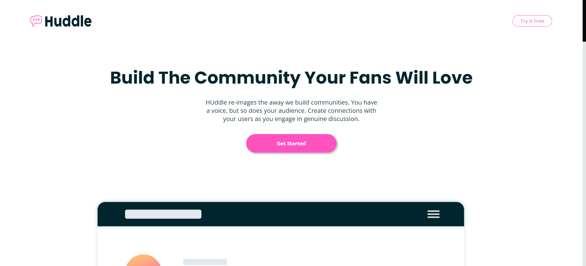

# Frontend Mentor - Huddle landing page with curved sections solution

This is a solution to the [Huddle landing page with curved sections challenge on Frontend Mentor](https://www.frontendmentor.io/challenges/huddle-landing-page-with-curved-sections-5ca5ecd01e82137ec91a50f2). Frontend Mentor challenges help you improve your coding skills by building realistic projects. 

## Table of contents

- [Overview](#overview)
  - [Screenshot](#screenshot)
  - [Links](#links)
- [My process](#my-process)
  - [Built with](#built-with)
- [Author](#author)

## Overview

### Screenshot

### Links

- Solution URL: [Solution](https://www.frontendmentor.io/solutions/landing-page-with-curved-section-footer-qhn-OGXExj)
- Live Site URL: [View solution](https://projects-html-css-js-hazel.vercel.app/frontend-mentor-solutions/huddle-landing-page-with-curved-sections-master/index.html)

## My process

### Built with

- Semantic HTML5 markup
- CSS custom properties
- Flexbox
- Position CSS
- Animation CSS
- JavaScript

## Author

- Frontend Mentor - [@WillianArevalo](https://www.frontendmentor.io/profile/WillianArevalo)