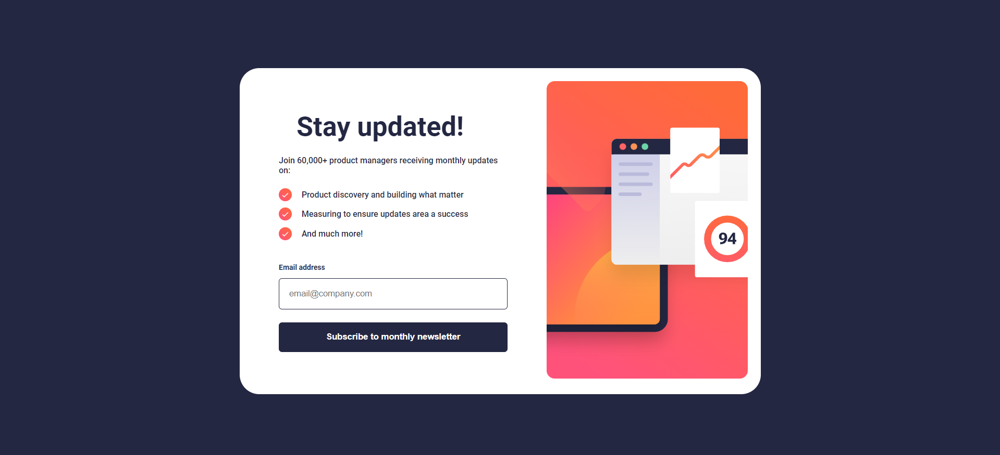

# Frontend Mentor - Newsletter sign-up form with success message solution

This is a solution to the [Newsletter sign-up form with success message challenge on Frontend Mentor](https://www.frontendmentor.io/challenges/newsletter-signup-form-with-success-message-3FC1AZbNrv). Frontend Mentor challenges help you improve your coding skills by building realistic projects. 

## Table of contents

- [Overview](#overview)
  - [Screenshot](#screenshot)
  - [Links](#links)
- [My process](#my-process)
  - [Built with](#built-with)
  - [What I learned](#what-i-learned)
- [Author](#author)

## Overview

Desing sign up with message success and validation input email. 

### Screenshot

### Links

- Solution URL: [Solution](https://www.frontendmentor.io/solutions/sing-up-with-message-success-and-validation-input-email-AMM3pqN6je)
- Live Site URL: [View Solution](https://projects-html-css-js-hazel.vercel.app/frontend-mentor-solutions/newsletter-sign-up-with-success-message-main/index.html)

## My process

### Built with

- Semantic HTML5 markup
- CSS custom properties
- Flexbox
- Position CSS
- Animation CSS
- JavaScript

### What I learned

I learned how to use CSS animations.

## Author

- Frontend Mentor - [@WillianArevalo](https://www.frontendmentor.io/profile/WillianArevalo)