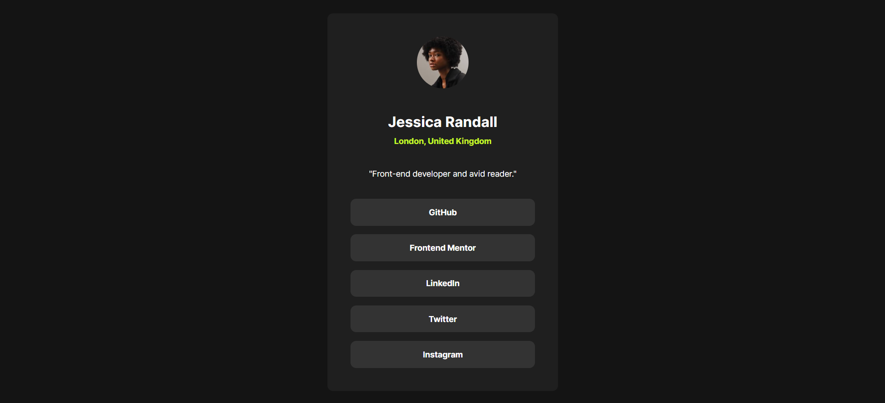

# Frontend Mentor - Social links profile solution

This is a solution to the [Social links profile challenge on Frontend Mentor](https://www.frontendmentor.io/challenges/social-links-profile-UG32l9m6dQ). Frontend Mentor challenges help you improve your coding skills by building realistic projects.

## Table of contents

- [Overview](#overview)
  - [The challenge](#the-challenge)
  - [Screenshot](#screenshot)
  - [Links](#links)
- [My process](#my-process)
  - [Built with](#built-with)
  - [What I learned](#what-i-learned)
  - [Continued development](#continued-development)
- [Author](#author)

## Overview

This web design is a design of a user's profile with different links from their social networks.

### The challenge

Users should be able to:

- See hover and focus states for all interactive elements on the page

### Screenshot

### Links

- Solution URL: [Solution](https://www.frontendmentor.io/solutions/frontend-mentor-social-links-profile-Vx0gZXa05X)
- Live Site URL: [View Solution](https://projects-html-css-js-hazel.vercel.app/frontend-mentor-solutions/social-links-profile/index.html)

## My process

### Built with

- Semantic HTML5 markup
- CSS custom properties
- Flexbox

### What I learned

I learned to use and learn more about how the flexbox works in CSS and how to structure the HTML so that there is no problem in the CSS when giving it a design.

### Continued development

Use the flexbox of CSS

## Author

- Frontend Mentor - [@WillianArevalo](https://www.frontendmentor.io/profile/WillianArevalo)
